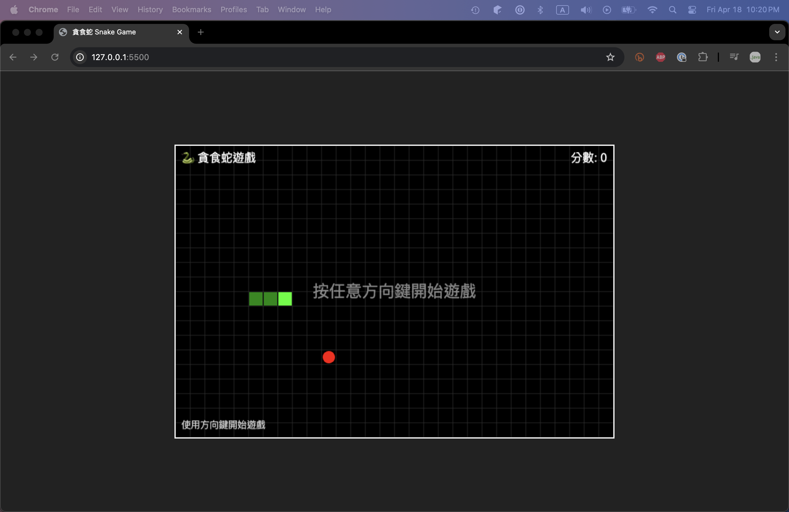

# 🐍 貪食蛇遊戲 Snake Game

一個用 Phaser 3 開發的經典貪食蛇遊戲。



## 📝 專案簡介

這是一個使用 Phaser 3 遊戲引擎開發的經典貪食蛇遊戲。遊戲包括了所有貪食蛇應有的基本功能，如控制蛇的移動、吃食物成長、碰撞檢測以及計分系統等。

## 🎮 遊戲操作

- **方向鍵** - 控制蛇的移動方向
- **空白鍵** - 遊戲結束後，按下空白鍵重新開始遊戲

## ✨ 功能特點

- 簡潔清晰的網格系統
- 流暢的鍵盤控制
- 即時分數計算與顯示
- 碰撞偵測（邊界和自撞）
- 遊戲結束與重新開始功能
- 適合初學者理解的程式碼結構

## 🚀 如何開始

1. 克隆本專案
   ```bash
   git clone https://github.com/yourusername/the-snake-game.git
   ```

2. 打開 `index.html` 檔案在瀏覽器中運行
   - 建議使用 Live Server 或其他本地伺服器來運行

## 🛠️ 技術實現

- **語言**：JavaScript
- **遊戲引擎**：Phaser 3
- **渲染**：HTML5 Canvas
- **開發工具**：支援 ES6+ 的現代瀏覽器

## 📖 開發文檔

如果你對這個專案的開發過程感興趣，請查看 [v1 版實作步驟](v1_implementation_steps.md)，其中詳細記錄了整個遊戲的開發步驟與技術要點。

## 📜 授權

MIT License

## 👨‍💻 作者

Chan Ching-Yi
---

🎮 **享受遊戲！** 🎮